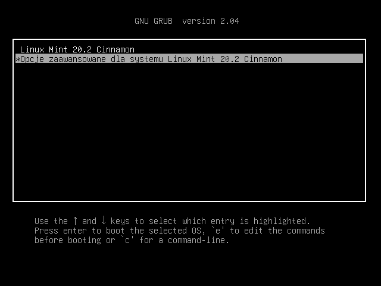
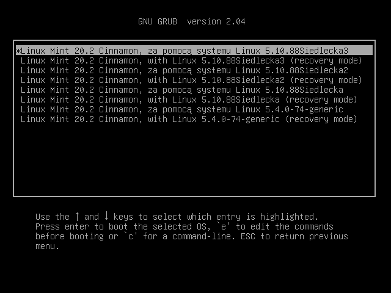

# Skrypt kompilujący jądro Linux

## Spis treści

1. [Opis](#opis)
2. [Efekty działania narzędzia](#efekty-działania-narzędzia)
3. [Instrukcja uruchamiania](#instrukcja-uruchamiania)
4. [Menu aplikacji](#menu-aplikacji)
5. [Kernele do kompilacji i narzędzia benchmark](#kernele-do-kompilacji-i-narzędzia-benchmark)

## Opis

Projekt z Administrowania Systemami Komputerowymi - skrypt automatyzujący proces kompilacji jądra Linux. 

Program wykonuje wszystkie kroki potrzebne do kompilacji jądra i udostępnia użytkownikowi opcję konfiguracji budowanego kernela, aby umożliwić mu tworzenie głównego elementu systemu o parametrach spełniających jego oczekiwania. Narzędzie umożliwia przerywanie i wznawanie pracy nad zmianą ustawień budowanego jądra, dzięki możliwości zapisywania i wczytywania ustawień. Skrypt po skompilowaniu jądra również od razu kopiuje jego pliki w odpowiednie miejsca widoczne dla bootloader'a, aby można było wybrać nowy kernel już przy następnym uruchomieniu systemu.

Program jest przydatnym narzędziem do automatyzacji powtarzalnych czynności w procesie kompilacji jądra, zostawiając użytkownikowi tylko tę ciekawszą, kreatywną część procesu.

## Efekty działania narzędzia

Po wykonaniu skryptu i skompilowaniu się nowego kernela, jest on od razu instalowany i dostępny przy następnym uruchomieniu systemu. Kiedy ponownie będziemy uruchamiali maszynę, powinniśmy zobaczyć menu wyboru (tutaj przykład dla systemu Linux Mint 20.2):



Należy wybrać opcję "Opcje zaawansowane...". Na następnym ekranie powinniśmy znaleźć nowy kernel do wyboru:



Wybieramy kernel z nazwą, jaką mu nadaliśmy. Po wybraniu, system uruchomi się z nowym kernelem. Jeżeli wszystko zadziała, można używać systemu z nowym jądrem i jeśli chcemy, również przetestować jego wydajność wykonując testy benchmark.

## Instrukcja uruchamiania

Sposób obsługi programu został opisany również bezpośrednio w pliku skryptu (w komentarzu na początku pliku).

Na początku skryptu są umieszczone zmienne, które można zmodyfikować przed jego wykonaniem, tj. architektura procesora, nazwa dla kompilowanego kernela, czy link, z którego zostaną pobrane pliki źródłowe jądra do kompilacji. Sama konfiguracja budowanego kernela odbywa się natomiast po włączeniu skryptu.

**Uwaga:** Przed rozpoczęciem procesu kompilacji, upewnij się, że masz sporo wolnego miejsca na dysku, ok. 20 GB lub więcej, ponieważ pliki tymczasowe, które się tworzą podczas kompilacji jądra, zajmują dużo pamięci.

Skrypt można uruchomić w systemie Linux w standardowy sposób:

```
# nadanie uprawnień do wykonywania pliku
chmod +x auto_kernel.sh

# jeśli chcemy modyfikować zmienne skryptu, musimy dodać także uprawnienia odczytu i zapisu
chmod +rw auto_kernel.sh

# uruchamianie
./auto_kernel.sh
```

Jeśli po skompilowaniu kernela użytkownik chce przetestować nowe jądro, można skorzystać z dodatkowych skryptów do testowania parametrów nowego kernela znajdujących się w folderze `TestowanieKernela`. Sposób ich używania opisano w oddzielnym pliku [README.md](./TestowanieKernela), znajdującym się w tym samym katalogu.

## Menu aplikacji

Program po uruchomieniu najpierw pobiera i rozpakowuje pliki źródłowe jądra Linux spod linku podanego w zmiennych na początku skryptu. Następnie użytkownikowi zadawane jest pytanie:

1. Tworzenie startowego pliku konfiguracyjnego
```
Czy chcesz stworzyć nowy plik konfiguracyjny (.config)? (T/n)
```

Za pierwszym uruchamieniem aplikacji dla danego kernela, powinniśmy wybrać opcję 'T', aby został utworzony plik z domyślną konfiguracją. Następnie można przejść do samodzielnej zmiany ustawień:

2. Modyfikowanie domyślnej konfiguracji
```
Czy chcesz zmodyfikować plik konfiguracyjny (.config)? (T/n)
```

Jeśli wybierzemy opcję 'T', otworzy się standardowe okno pozwalające na modyfikowanie pliku z ustawieniami jądra, zapewniane przez polecenie `make xconfig`.

Po zmianie ustawień i zamknięciu okna, ponownie zostaniemy zapytani, czy chcemy kontynuować modyfikowanie pliku konfiguracyjnego:

```
Czy chcesz zmodyfikować plik konfiguracyjny (.config)? (T/n)
```

Jeśli jesteśmy już zadowoleni z wybranych ustawień, powinniśmy wpisać odpowiedź 'n'.

Następnie, użytkownik będzie miał wybór, czy chce wykonać kompilację jądra teraz, czy zostawić ten proces na później - kompilacja jest dość długotrwałym procesem i może zająć ok. 30 minut lub więcej:

3. Kompilacja i instalacja jądra

```
Czy chcesz teraz skompilować kernel i moduły? (T/n) (Odpowiedź 'n' wyłączy program.
Aby wrócić do obecnego stanu tworzenia kernela wystarczy go włączyć ponownie z tego
samego katalogu, w jakim został uruchomiony teraz)
```

Jak wyjaśniono w podpowiedzi, po wybraniu opcji 'n' wyjdziemy z programu, a żeby wznowić pracę z tego samego etapu, na którym ją zakończyliśmy, wystarczy ponownie uruchomić skrypt będąc w tej samej lokalizacji w konsoli, w której go uruchomiliśmy (ze względu na tworzone przez skrypt foldery z plikami źródłowymi jądra i plikiem konfiguracyjnym).

Wybierając natomiast opcję 'T', od razu rozpocznie się proces kompilacji oraz instalacji nowego jądra. Od tego momentu nie trzeba już podawać żadnych danych do skryptu - można zostawić maszynę, a kompilacja wykona się bez naszego udziału.

**Uwaga:** Podczas kompilacji można napotkać na problem z certyfikatami i kluczami - [tutaj](https://stackoverflow.com/questions/67670169/compiling-kernel-gives-error-no-rule-to-make-target-debian-certs-debian-uefi-ce#:~:text=This%20seems%20to%20be%20the%20way%20to%20go%20with%20the%20current%20version) można znaleźć obejście dla tego problemu. Można spróbować wykonać kompilację bez uprzedniego zastosowania tej porady, a dokonać zmian tylko, jeśli błąd wystąpi - może to jednak oznaczać konieczność ponownego uruchomienia procesu kompilacji i ręczego usunięcia dotychczasowo skompilowanych plików tymczasowych (nie należy oczywiście usuwać pliku konfiguracyjnego!).

## Kernele do kompilacji i narzędzia benchmark

Pliki źródłowe różnych wersji jądra Linux można pobrać np. ze strony [kernel.org](https://kernel.org/) lub bezpośrednio z repozytorium twórcy, Linusa Torvaldsa - [linux](https://github.com/torvalds/linux).

Aby testować wydajność skompilowanych kerneli, można użyć narzędzia do testów benchmark [phoronix-test-suite](https://github.com/phoronix-test-suite/phoronix-test-suite). W katalogu `TestowanieKernela` można znaleźć dodatkowy skrypt instalujący to oprogramowanie - `phoronix_instalacja.sh` oraz drugi, do uruchamiania serii testów benchmark - `auto_testy.sh`. 
